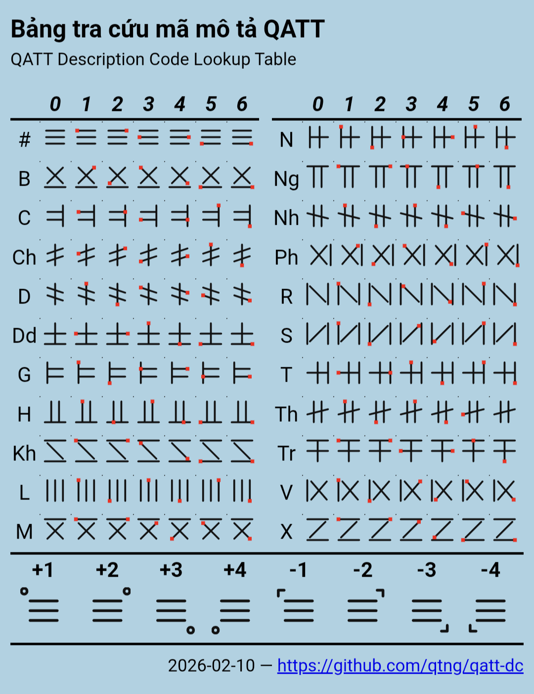

# QATT Description Code – Specification

## 1. Syntax (BNF)

```text
<QATT-Code> ::= <Letter><Dot><Tone>  
<Letter>    ::= B | C | Ch | D | Dd | G | H | Kh | L | M | N | Ng | Nh | Ph | R | S | T | Th | Tr | V | X
<Dot>       ::= 0 | 1 | 2 | 3 | 4 | 5 | 6
<Tone>      ::= +1 | +2 | +3 | +4 | -1 | -2 | -3 | -4
<IDS>       ::= ⿰<QATT-Code><QATT-Code> | ⿱<QATT-Code><QATT-Code> | ⿲<QATT-Code><QATT-Code><QATT-Code> | ⿳<QATT-Code><QATT-Code><QATT-Code>
```

## 2. Components Overview (Table)

| Component | Syntax / Options | Notes |
|-----------|-----------------|-------|
| Letter    | B, C, Ch, D, Dd, G, H, Kh, L, M, N, Ng, Nh, Ph, R, S, T, Th, Tr, V, X | Base sign (cán tự) |
| Dot (phẩy) | 0, 1, 2, 3, 4, 5, 6 | Placement on strokes |
| Tone (thanh điệu) | +1, +2, +3, +4, -1, -2, -3, -4 | plus sign for full tone symbol "ₒ", minus sign for half tone symbol "꜀", number designates corner placement (1=top-left … 4=bottom-left) |
| IDS       | ⿰, ⿱, ⿲, ⿳ | Ideographic sequences  

---

## 2. Component Meaning

1. **Base Symbol** – Base symbol (cán tự) from Quốc Âm Tân Tự, the symbol name is case sensitive, i.e. first letter is uppercase and subsequent letters are lowercase.  
2. **Dot Marking** – Optional dot (phẩy), number indicates placement on strokes:
    - 1/2 → beginning/end of first stroke  
    - 3/4 → beginning/end of second stroke  
    - 5/6 → beginning/end of third stroke  
3. **Tone** – `°` = whole tone symbol (thanh điêu dương), `꜄` = half tone symbol (thanh điêu âm)
    - Number indicates corner: 1 = top-left, 2 = top-right, 3 = bottom-right, 4 = bottom-left  
4. **IDS** – Combines multiple QATT codes to represent complex characters

---

## 3. Examples

| QATT-Code  | Description                                        | SVG |
|------------|---------------------------------------------------|-----|
| Tr1+8      | Base symbol Tr (廾) with dot at start of first stroke and half tone symbol at position 4 (bottom-left) | ꜀牛 |
| Dd3+1 | Base symbol Dd (士) with dot at start of second stroke and full tone symbol at position 1 (top-left) | ⁰壬 |
| ⿱ThDd-2 | Combined character consisting of unmarked Th on top of Dd with half tone symbol at position 2 (top-right) | 芏꜄ |

---

## 4. Notes
- QATT Description Code describes **visual structure only**; no semantic meaning.  
- Extensible to new letters, dot positions, tones, and IDS sequences.

## 5. Reference Table


